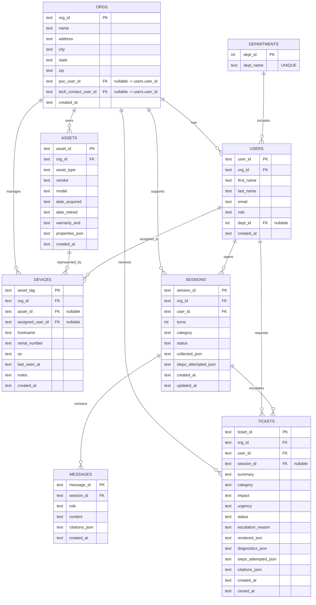

# ER Diagram

```mermaid
erDiagram
    ORGS ||--o{ USERS : has
    DEPARTMENTS ||--o{ USERS : includes
    ORGS ||--o{ ASSETS : owns
    ORGS ||--o{ DEVICES : manages
    ASSETS ||--o{ DEVICES : represented_by
    USERS ||--o{ DEVICES : assigned_to
    ORGS ||--o{ SESSIONS : supports
    USERS ||--o{ SESSIONS : opens
    SESSIONS ||--o{ MESSAGES : contains
    ORGS ||--o{ TICKETS : receives
    USERS ||--o{ TICKETS : requests
    SESSIONS ||--o{ TICKETS : escalates

    ORGS {
      text org_id PK
      text name
      text address
      text city
      text state
      text zip
      text poc_user_id FK "nullable -> users.user_id"
      text tech_contact_user_id FK "nullable -> users.user_id"
      text created_at
    }

    DEPARTMENTS {
      int dept_id PK
      text dept_name "UNIQUE"
    }

    USERS {
      text user_id PK
      text org_id FK
      text first_name
      text last_name
      text email
      text role
      int dept_id FK "nullable"
      text created_at
    }

    ASSETS {
      text asset_id PK
      text org_id FK
      text asset_type
      text vendor
      text model
      text date_acquired
      text date_retired
      text warranty_end
      text properties_json
      text created_at
    }

    DEVICES {
      text asset_tag PK
      text org_id FK
      text asset_id FK "nullable"
      text assigned_user_id FK "nullable"
      text hostname
      text serial_number
      text os
      text last_seen_at
      text notes
      text created_at
    }

    SESSIONS {
      text session_id PK
      text org_id FK
      text user_id FK
      int turns
      text category
      text status
      text collected_json
      text steps_attempted_json
      text created_at
      text updated_at
    }

    MESSAGES {
      text message_id PK
      text session_id FK
      text role
      text content
      text citations_json
      text created_at
    }

    TICKETS {
      text ticket_id PK
      text org_id FK
      text user_id FK
      text session_id FK "nullable"
      text summary
      text category
      text impact
      text urgency
      text status
      text escalation_reason
      text rendered_text
      text diagnostics_json
      text steps_attempted_json
      text citations_json
      text created_at
      text closed_at
    }
```
